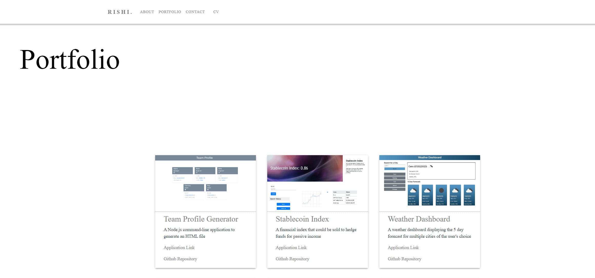

# React-Portfolio
A portfolio of my front-end web projects, created with React

## Description

This application has been built with React to showcase the skills I have learnt during the bootcamp. It contains a header section, including navbar, that renders across the whole site, an About Me section, Project Gallery, Contact section and link to my CV.

Packages/libraries used in the application build include:
- react-router-dom
- Material UI
- Bootstrap

The deployed application can be viewed at https://rishibajaj.github.io/React-Portfolio

## Usage

Browse through the website to learn more about my experience as a front-end web developer. Click on the links in the project gallery cards to learn more about each project.

## License

MIT

